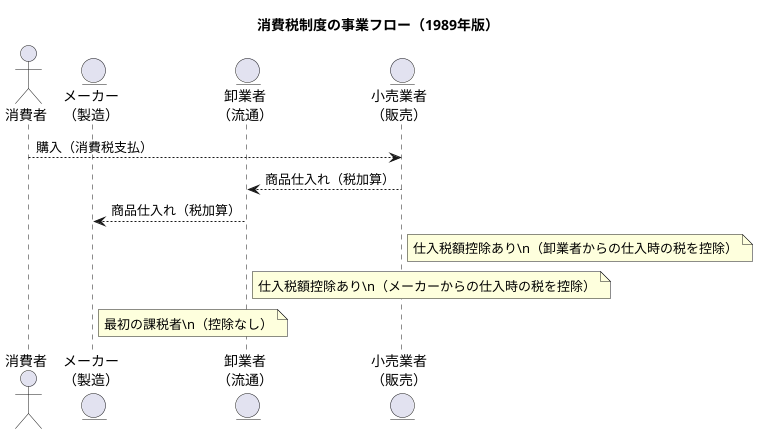

# 🏗️ `architectural_design.md`

## 消費税制度 アーキテクチャ設計書（1989年）

---

## 🎯 1. 設計目的（Design Goals）

| 目的 | 解説 |
|------|------|
| **税収の安定化** | 所得税や法人税に依存しない恒常的な税源の確保 |
| **課税の公平性** | 所得や法人格に関係なく、広く・薄く負担する仕組み |
| **経済への中立性** | 生産・流通・販売など取引形態を問わず、均等に課税 |
| **制度の透明性** | 税額が価格から明確に分かる「外税方式」を採用 |

---

## 🧩 2. 制度アーキタイプ（System Archetype）

- 税制としては「**付加価値税（VAT）型**」
- 中間取引においても課税されるが、**仕入控除構造により累積課税を回避**
- **「徴収者と負担者が異なる」**というアーキテクチャ上の分離構造
- 各事業者が自己の段階での付加価値に課税し、前段階の税額を控除

---

## 🧠 3. 設計思想（Design Philosophy）

| 原則 | 説明 |
|------|------|
| **透明性と納得性** | 外税表示により消費者が税の存在と負担を認識できる |
| **簡素な運用性** | 控除構造や免税制度により中小事業者への配慮を実装 |
| **制度信頼性** | 税務署・事業者間の記録整備による相互チェック体制 |
| **段階的負担原則** | 消費過程の各段階での税負担 → 最終消費者へ集約 |

---

## 🔄 4. 構造的コンポーネント（Architecture Modules）

| モジュール | 内容 |
|------------|------|
| 課税取引判定ロジック | 国内での財やサービスの提供／輸入か否か |
| 納税者決定アルゴリズム | 事業者かつ免税点超過か否かの条件判定 |
| 控除計算エンジン | 売上税額 − 仕入税額で算出される納税額 |
| 申告・納付モジュール | 年次ベースでの自己申告および納税処理 |
| 簡易課税パターン | 小規模事業者向けに業種ごとの控除率適用 |

---

## 🏛️ 5. 制度ガバナンス設計（Governance and Control）

| 制御機構 | 説明 |
|----------|------|
| 税務調査 | 記録・帳簿の整備義務によるチェック体制 |
| 免税点制度 | 小規模事業者保護と制度の導入容易性確保 |
| 法律改正可能性 | 段階的な制度アップデートに備えた柔軟性設計 |

---

## 🧭 6. 初期リリース戦略（1989年当初）

- **制度的ミニマム実装**（MVP的）：税率一律・軽減税率なし・外税表示のみ
- **小規模事業者への猶予構造**：免税点制度・簡易課税方式による初期反発対策
- **告知と啓蒙の不足**が初期バグを誘発（制度UXの欠如）

---

## 🧵 7. 制度的連携（外部I/F）

| 連携先 | 内容 |
|--------|------|
| 関税法 | 輸入取引への課税対象判断 |
| 所得税法／法人税法 | 仕入・経費との関係性 |
| 地方自治法（後年） | 地方消費税の追加による課税構造の拡張 |

---

## 🔚 8. 終わりに（設計としての意義）

本制度は、法制度を単なる命令体系としてではなく、**社会経済システムの一部として再構築する設計的挑戦**であった。  
導入当初は多くのバグを抱えていたが、構造そのものは**後の制度アップデート（8%、10%、インボイス等）にも耐えうる設計基盤**を提供していた点で極めて意義深い。
